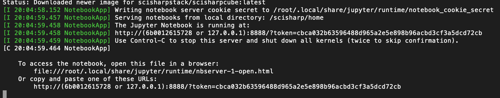
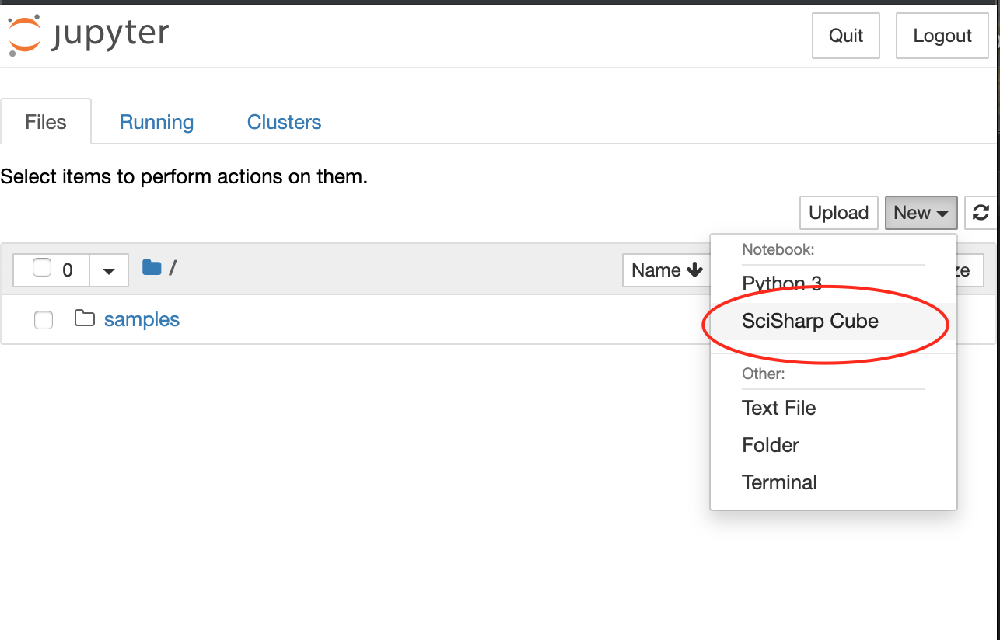
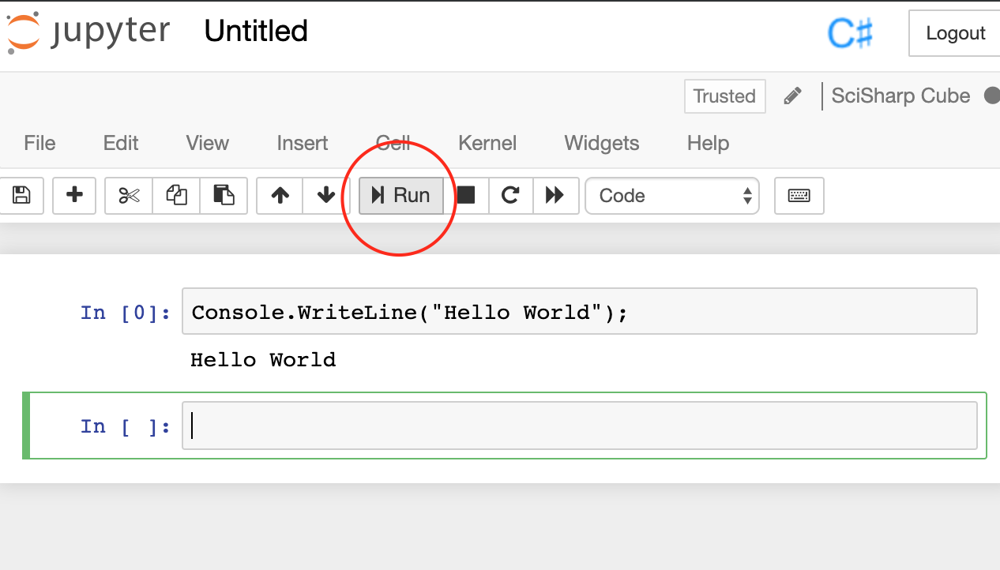
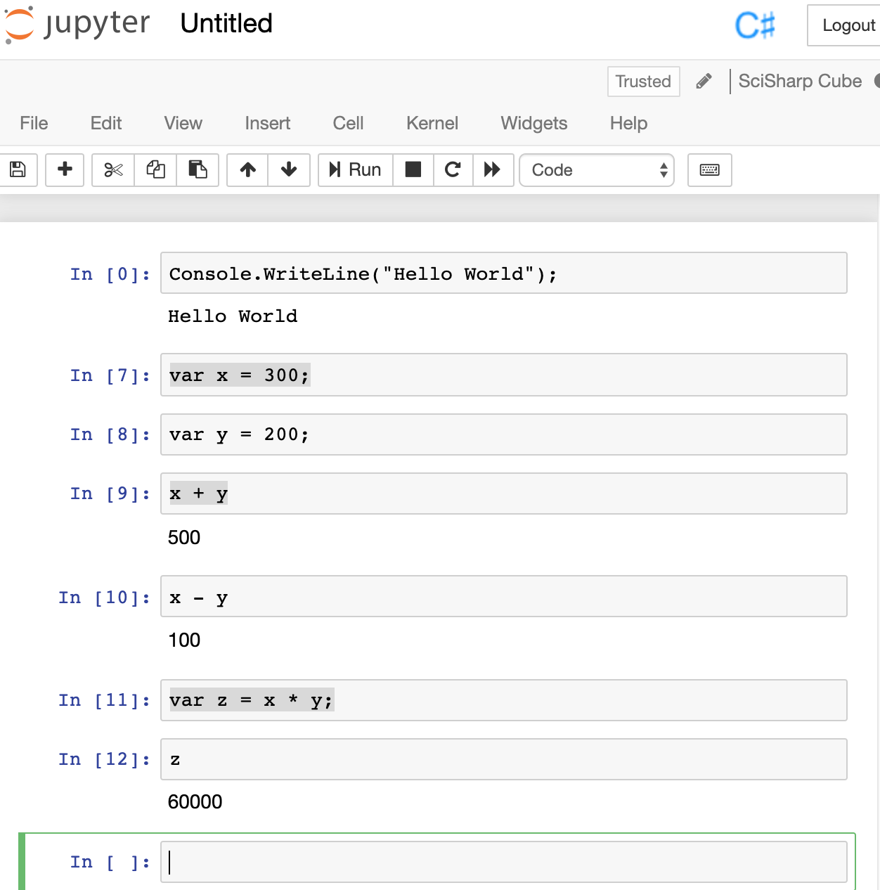
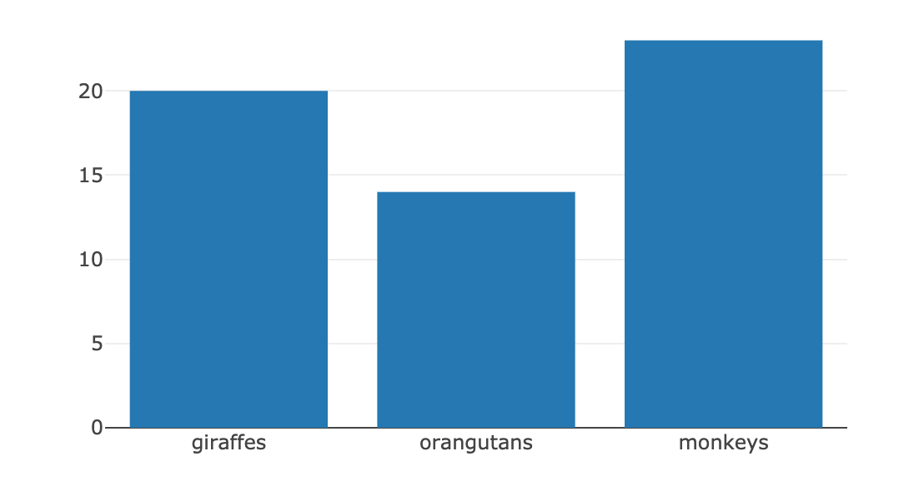

# Play C# and Tensorflow.NET with Jupyter Notebook (Part 1)

Today, the **SchiSharp Community** officially announced their .NET Core kernel for the Jupyter Notebook **ICSharpCore** (https://github.com/SciSharp/ICSharpCore) is ready. And an out-of-box docker image has been pushed to the Docker hub (scisharpstack/scisharpcube).

It means we can play C# and Tensorflow.NET with the Jupyter Notebook without having to worry about installing related environment and software components.

## Run the docker container

So, let's just get started by running the docker image directly.

    docker run --name scisharp -it -p 8888:8888 scisharpstack/scisharpcube

This command will pull the latest version of the image from the Docker Hub if it doesn't exist in your local. And then the Jupyter Notebook will be started.

If you see the similar message in your terminal, that means the Jupyter Notebook has started successfully.

To access the Jupyter Notebook, you just need visit the URL in the last line of the output with any web browser you have.

## Run C# in the Jupyter Notebook

The first page you can see is the Jupyter Notebook's homepage. On this page, you can click the "New" button on the right and then you will see a dropdown menu which shows you all the notebook types you can create.

Just click the menu item "SciSharp Cube" to create a C# notebook.

It's the showtime right now. Let's leave the "Hello World" in the first input line and then click the "Run" button.

    Console.WriteLine("Hello World");

The execution of the first statement may take longer time because it will download some dependencies from nuget in the runtime. Seconds later, you will see the text "Hello World" shows up beneath the first input line as shown in the figure below.

Let's practice more with C#

    var x = 300;
    var y = 200;
    x + y
    x - y
    var z = x * y;
    z

Please put each line of the code above into seperated input lines in the notebook and then run them one by one following the order.

You may learn that, if the line of code is an expression instead of a statement which doesn't have a semicolon in the end, the Notebook will send the result of the expression as output. This is one way to know the value of one variable.

If you want to use an external library, just reference it from NuGet by the statement below:

    #r "nuget: WebSocket4Net, 0.15.2"

## Show chart using C# in the Jupyter Notebook

The **SciSharp Community** also developed the project **Plot.NET**, which is an .NET wrapper of plotly.js for ICSharpCore. https://github.com/SciSharp/Plot.NET

It can be used for plotting with C# in the Jupyter Notebook.

At first, we already reference the **PlotNET** nuget package by default automatically, so now you just need add the using for the namespace:

    using PlotNET;

Then, create a Plotter instance to build a bar chart:

    var plotter = new Plotter();
    
    plotter.Plot(
        new [] { "giraffes", "orangutans", "monkeys" },
        new [] { 20, 14, 23 },
        "Animals", ChartType.Bar);
        
    plotter.Show(500, 300);

After you run them, you will see the chart as shown in the figure below.

## Try Tensorflow.NET in the Jupyter Notebook

We are going to run the HelloWorld example in the Jupyter right now. (https://github.com/SciSharp/TensorFlow.NET/blob/master/test/TensorFlowNET.Examples/HelloWorld.cs)

Because the kernel has refererenced the **Tensorflow.NET** by default, so we can declare the using statement directly:

    using Tensorflow;

Fill the major part of the HelloWorld example:

    var str = "Hello, TensorFlow.NET!";
    var hello = tf.constant(str);

    // Start tf session
    using(var sess = tf.Session())
    {
        // Run the op
        return sess.run(hello);
    }

And then run all the steps. If you can see the output text "Hello, TensorFlow.NET!", that means the **TensorFlow.NET** generally works in the Jupyter Notebook.

