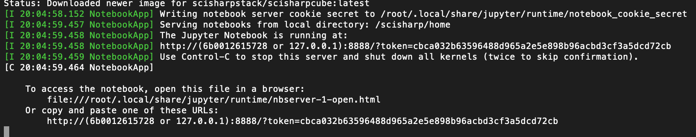
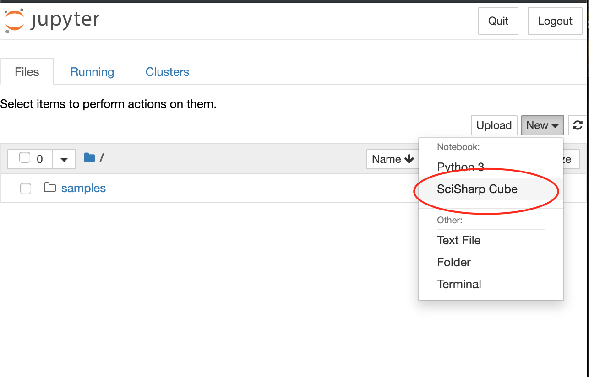
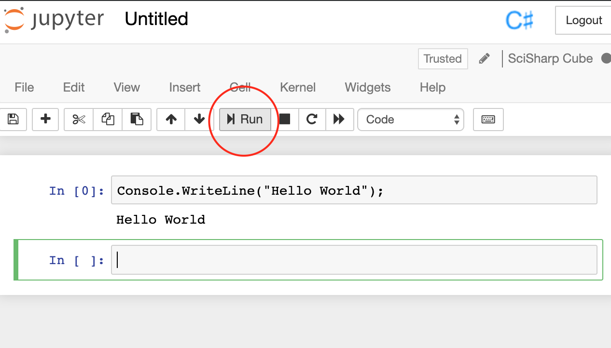
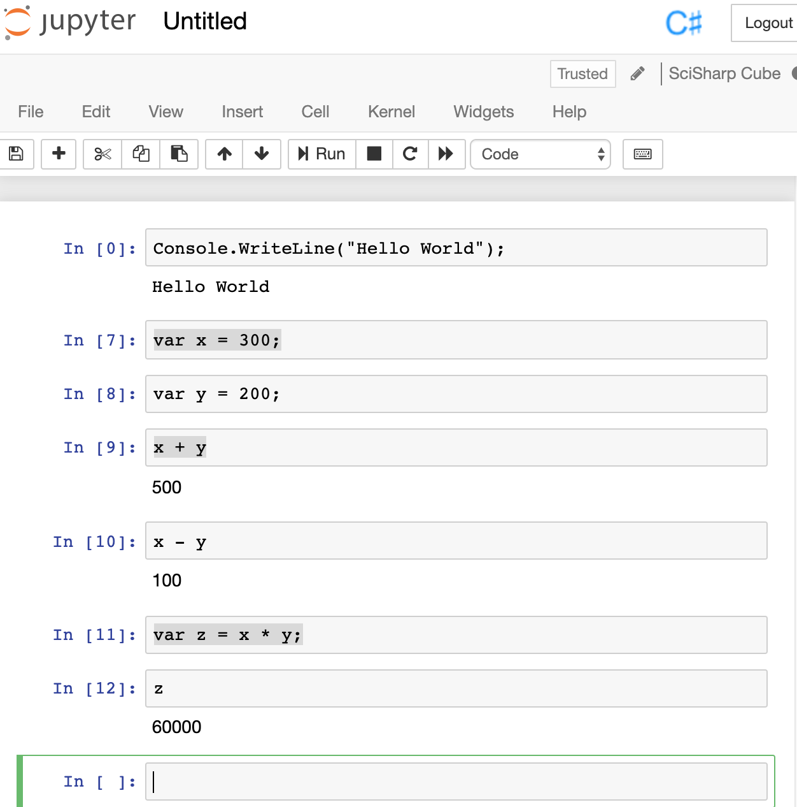
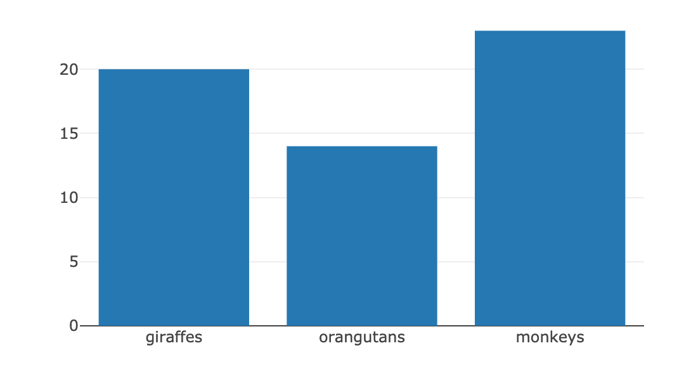

# 在 Jupyter Notebook 玩转 C# 和 TensorFlow.NET (Part 1)

今天，SchiSharp 技术社区正式宣布用于Jupyter Notebook 的.NET Core kernel _ICSharpCore_ (https://github.com/SciSharp/ICSharpCore) 基本就绪。 而且，开箱即用的docker 镜像已经被推送到Docker hub (scisharpstack/scisharpcube)。

这就意味着我们可以不用自己安装相关的运行环境和软件组件而直接在让 C# 和 Tensorflow.NET 运行在Jupyter Notebook。

## 运行 docker container

让我们先运行这个docker容器吧。

    docker run --name scisharp -it -p 8888:8888 scisharpstack/scisharpcube

如果这个docker镜像在本地不存在的话，这个命令将从Docker Hub拉取这个镜像的最新版本。然后Jupyter Notebook就会被启动。

如果你在你的terminal看到了类似的信息，那就说明你的Jupyter Notebook已经启动成功了。

访问Jupyter Notebook，你只需要在你本机已有的浏览器中浏览在terminal输出信息的最后一行中的URL。

## 在 Jupyter Notebook 中运行C#

你看到的第一页是 Jupyter Notebook 的首页。在那个页面，你可以点击右方的“New”按键, 然后你就会看到显示所有Notebook类型的下拉菜单。

点击菜单项 "SciSharp Cube" 以新建一个C# notebook。

开演时间到。让我们在第一个输入行中输入能够打印"Hello World"的代码，然后点击运行按键。

    Console.WriteLine("Hello World");

第一条语句的运行会耗时较长一点，因为此时它会从NuGet下载一些依赖包。数秒钟以后，你会在第一个输入框下看到文字“Hello World”。

来，我们再多做几个C#的练习吧：

    var x = 300;
    var y = 200;
    x + y
    x - y
    var z = x * y;
    z

请将上方的代码一行一行的复制到notebook中的，一行代码占用一个输入框。让后按照顺序运行它们。

你可能会了解到，如果这行代码是一个表达式而不是因个完整的语句（没有分号作为结束符），notebook会将表达式的值显示为输出。这是我们获取某个变量值的方法之一。

如果你需要引用外部类库，那就需要通过下面的语句从NuGet引用它：

    #r "nuget: WebSocket4Net, 0.15.2"

## 在 Jupyter Notebook 中用 C# 显示图表

SciSharp community 还开发了一个叫 Plot.NET 的项目。他是一个为ICSharpCore做的 plotly.js （一个javascript 图表库） 的.NET封装。 https://github.com/SciSharp/Plot.NET

它可以用于在 Jupyter Notebook 中使用 C# 来画图表。

首先，犹豫我们默认从NuGet引用了PlotNET，因此我们只需要先添加using 即可：

    using PlotNET;

然后创建一个Plotter实例来构建柱状图：

    var plotter = new Plotter();
    
    plotter.Plot(
        new [] { "giraffes", "orangutans", "monkeys" },
        new [] { 20, 14, 23 },
        "Animals", ChartType.Bar);
        
    plotter.Show(500, 300);

在你运行这些语句之后，你就会发现如下图所示的图表。

## 在 Jupyter Notebook 中使用 Tensorflow.NET

现在我们要在 Jupyter 中运行 TensorFlow.NET 的 HelloWorld这个示例了。(https://github.com/SciSharp/TensorFlow.NET/blob/master/test/TensorFlowNET.Examples/HelloWorld.cs)

由于kernel自动引用的 Tensorflow.NET，所以在此只需直接声明using语句就行了:

    using Tensorflow;

将 HelloWorld 示例的主要部分置于 notebook:

    var str = "Hello, TensorFlow.NET!";
    var hello = tf.constant(str);

    // Start tf session
    using(var sess = tf.Session())
    {
        // Run the op
        return sess.run(hello);
    }

然后运行所有步骤。如果你能看到输出的文字信息 "Hello, TensorFlow.NET!"，那就说明 TensorFlow.NET 已经可以运行在 Jupyter Notebook 中了。

